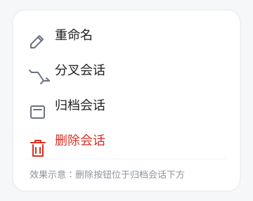

# dsh-session-manager

一个 Client-only DSH 插件，为 DSH Web 的会话记录和会话详情补充两个操作：

- 在会话记录菜单的“归档会话”下方添加“删除会话”；
- 在助手消息操作区添加“重新生成”，重新生成当前助手回复，而不是继续发送新的提示词。

## 功能效果

### 删除当前会话

打开会话记录中的 `...` 菜单，在“归档会话”下面点击“删除会话”，即可删除当前会话。



### 重新生成当前助手回复

在会话详情中找到需要重新生成的助手消息，点击消息操作区的“重新生成”：

1. 插件只针对当前这一条助手回复发起重新生成；
2. 原回复会被替换或先移除再生成，不会追加一条新的用户提示词；
3. 不会把重试行为变成“继续发送新消息”；
4. 生成期间页面保持当前会话上下文，不应出现白屏。

## 使用方式

### 1. 构建插件

```bash
pnpm install
pnpm build
```

### 2. 安装到 DSH Web profile

将下面的路径替换成插件实际所在目录：

```bash
dsh plugin --profile web add link:/path/to/dsh-session-manager
```

然后重启 DSH Web：

```bash
dsh web
```

如果之前安装过旧版本，建议先移除再重新安装：

```bash
dsh plugin --profile web remove dsh-session-manager
dsh plugin --profile web add link:/path/to/dsh-session-manager
```

### 3. 开始使用

- 进入任意会话，在会话记录菜单中使用“删除会话”；
- 在助手消息的操作区使用“重新生成”；
- 修改源码后重新执行 `pnpm build`，再重启对应的 `dsh web` profile，避免继续加载旧的 Client bundle。

## 兼容性

- DSH：`>=0.1.1-rc.2`
- Web Client：需要提供 `slots`、`workspaces` 和 `sessions` 注入能力。

## 实现说明

删除操作调用宿主公开的 `archiveSession` 能力。DSH 当前没有会话行菜单 Slot，因此菜单按钮使用兼容层插入，并在插件卸载时清理监听器、观察器和动态菜单项。

重新生成操作以当前助手消息为作用域，不能通过发送新的用户消息来模拟重试；实现时需要处理原消息替换、生成中状态、取消、异常和卸载清理。

插件包通过 `package.json` 的 `exports["./client"]` 和 `dsh.client` 配置加载 Client bundle；Host 入口仅用于保留标准插件加载契约，不注册 Tool 或其他 Host 状态。

## 开发

```bash
pnpm install
pnpm typecheck
pnpm test
pnpm build
```
